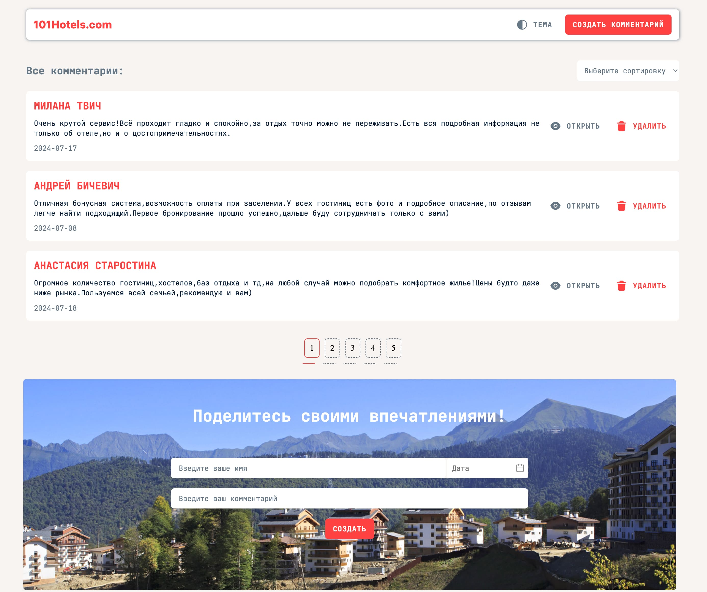

<h1 align="center">Сервис комментариев 101HOTELS</h1>

---

<p align="center">
    SPA, построенное на Vue2, которое позволяет людям делиться впечатлениями о прошедшем отдыхе и опыте взаимодействия с сервисом бронирования 101HOTELS.
</p>



## Содержание

- [Техническое задание](#Техническое-задание)
- [Функциональность](#Функциональность)
- [Стек](#стек)
- [Описание API](#Описание-API)
- [Первоначальная настройка](#Первоначальная-настройка)
- [Ссылки на проект](#Ссылки-на-проект)

## Техническое задание:

---

Создать сайт со списком комментариев. Форма добавления комментария должна располагаться под уже добавленными
комментариями.

Требования к разработке:

- добавление и удаление комментариев (без перезагрузки страницы);
- постраничный просмотр комментариев (3 комментария на страницу c возможностью выбора конкретной);
- сортировка по:
    - id;
    - дате добавления;
- направления сортировки:
    - по возрастанию;
    - по убыванию;
- реализация сортировки и пагинации на vue;
- использование при реализации готового пакета для vue2 (datepicker) – он будет автоматически установлен при настройке
  проекта, для реализации работы можно использовать axios;
- хранение комментариев в vuex (установить самостоятельно);
- учет результатов операций изменения и удаления комментариев при пагинации и сортировке;
- использование адаптивной верстки;
- использование js-фреймворка vue2;
- загрузка комментариев по ajax;
- использование vuex;
- реализация возможности изменять сортировку для пользователя;
- использование при создании комментария:
    - поля ввода для имени пользователя;
    - текста комментария;
    - выбора даты (через datepicker);
- запрещено использовать библиотеки готовых компонентов например vuetify и т.п.

## Функциональность:

---

- конфигурация `webpack`
- глобальные переменные стилей `global.scss`
- хранение данных в хранилище `Vuex`
- работа с `API`
- сортировка комментариев
- создание / редактирование / изменение / комментариев
- смена тем

## Стек:

---

<div id="stack">
  &nbsp
  &nbsp
  &nbsp
  &nbsp
  &nbsp
  &nbsp
  &nbsp
</div>

### Описание API

| Описание                        | Тип запроса |             Структура |                      Параметры |
|---------------------------------|:-----------:|----------------------:|-------------------------------:|
| Получить все комментарии        |     GET     |      `/api/comments/` |                                |
| Получить конкретный комментарий |     GET     | `/api/comments/${id}` | id - идентификатор комментария |
| Создать комментарий             |    POST     |      `/api/comments/` |                                |
| Удалить комментарий             |   DELETE    | `/api/comments/${id}` | id - идентификатор комментария |
| Обновить комментарий            |    PATCH    | `/api/comments/${id}` | id - идентификатор комментария |

## Описание записи

`{ name: 'Имя создателя', text: 'Текст комментария', date: 'Дата создания комментария в строковом формате(выбирается создателем)', }`

### Архитектура проекта - Feature-Sliced Design (FSD):

- `js/shared` — директория с переиспользуемыми модулями
- `js/entities` — директория с компонентами, связанными с представлением бизнес-сущностей
- `js/features` — директория с частями функциональности приложения
- `js/widgets` — директория с самостоятельными и полноценными блоками страниц с конкретными действиями
- `js/pages` — директория со страницами приложения
- `js/app` — директория с общей инициализирующей логикой приложения

### Первоначальная настройка

- Устанавливаем Docker c [официального сайта](https://www.docker.com/products/docker-desktop)
  и [Docker Compose](https://docs.docker.com/compose/install/);
- Для пользователей Windows дополнительно необходимо установить виртуальное ядро Linux, следуя
  данной [инструкции](https://docs.docker.com/desktop/install/windows-install/);
- Собираем контейнер командой в папке проекта `docker-compose up -d`;
- Инициализируем сервер:
    - при запущенном контейнере в папке проекта запускаем команду `docker-compose exec app bash`;
    - запускаем сборку `sed -i 's/\r$//' init.sh`, затем `bash ./init.sh`.

## Ошибка докера

В случае ошибки такого вида:

    Error response from daemon: pull access denied for nginx, repository does not exist or may require 'docker login': denied:
    <html>
    <body>
    <h1>403 Forbidden</h1>
    Since Docker is a US company, we must comply with US export control regulations.
    In an effort to comply with these, we now block all IP addresses that are located in Cuba, Iran, North Korea, Republic of Crimea, Sudan, and Syria.
    If you are not in one of these cities, countries, or regions and are blocked, please reach out to https://hub.docker.com/support/contact/
    </body>
    </html>

Нужно использовать прокси сервер

### Как его подключить

1. через конфиг докера (как зеркало docker.io)

   конфиг расположен в

   | операционная система     |          путь к файлу конфигурации          |
                            | ------------------------ | :-----------------------------------------: |
   | Linux, обычная установка |           /etc/docker/daemon.json           |
   | Linux, режим rootless    |        ~/.config/docker/daemon.json         |
   | Windows                  |  C:\ProgramData\docker\config\daemon.json   |
   | Windows с Docker Desktop | C:\Users\<Пользователь>\.docker\daemon.json |

   конфиг:
   { "registry-mirrors" : [ "https://dockerhub.timeweb.cloud" ] }

   чтобы конфиг применился потребуется перезапустить конфигурацию:
   systemctl reload docker

   теперь при попытке загрузки образа, Docker будет сначала пытаться использовать прокси.

1. явное указание адреса

    ```
    docker pull dockerhub.timeweb.cloud/library/alpine:latest

    docker pull dockerhub.timeweb.cloud/openresty/openresty:latest
    ```

## Сборка демо проекта

- при запущенном контейнере в папке проекта запускаем команду `docker-compose exec app bash`;
- собираем js `yarn dev`.

## Ссылки на проект:

---

- `Адрес репозитория:` https://github.com/ilkor4/101HOTELS
- `Над проектом работал:` https://github.com/ilkor4
